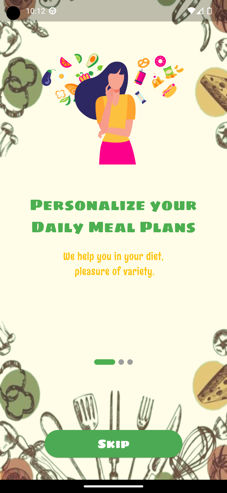
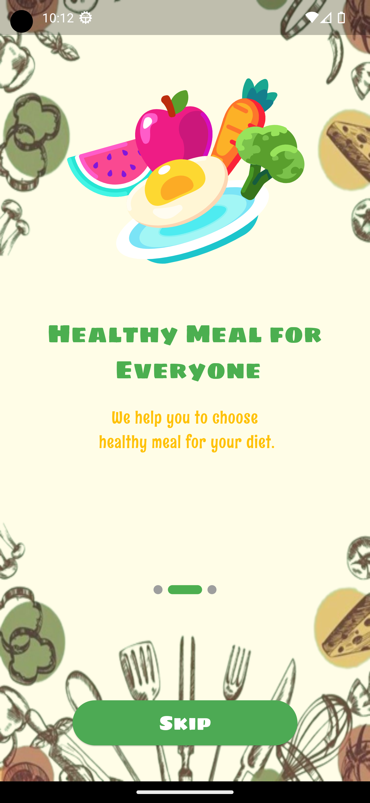
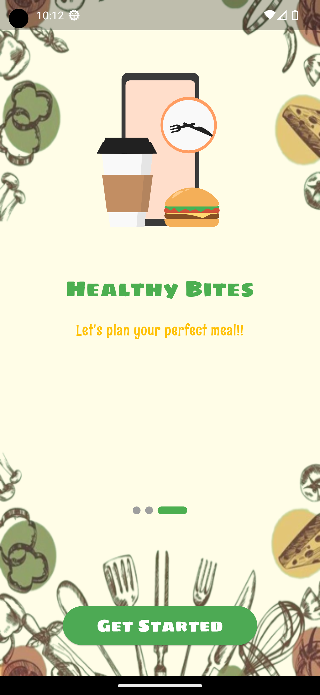
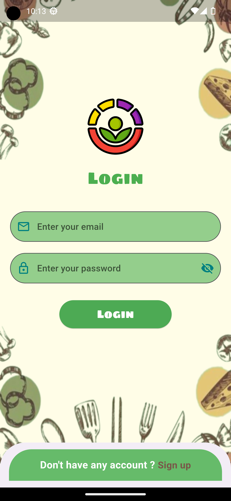
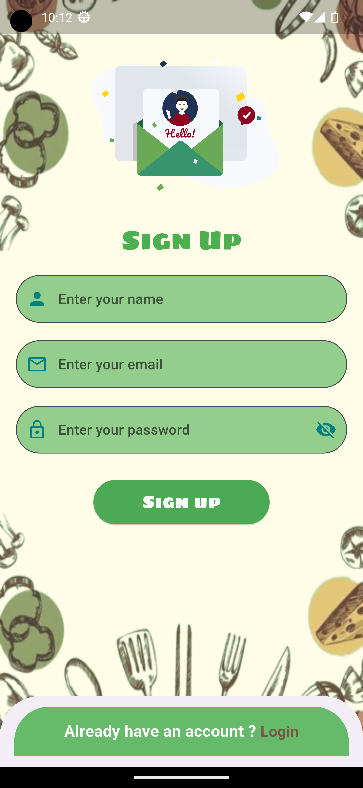
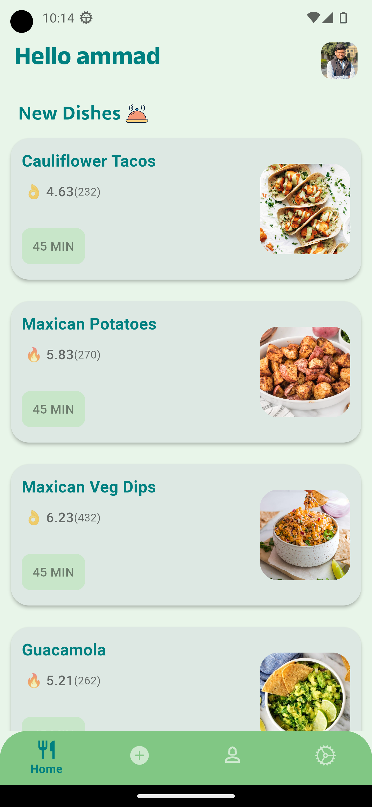
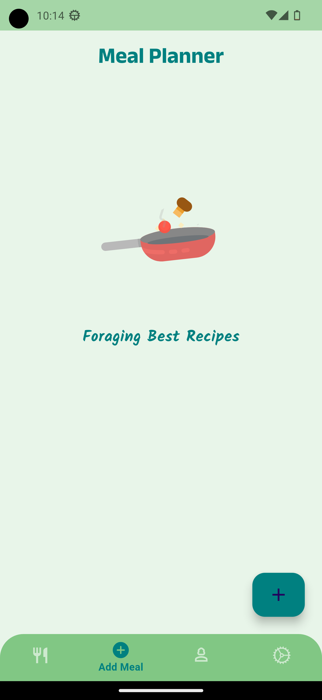
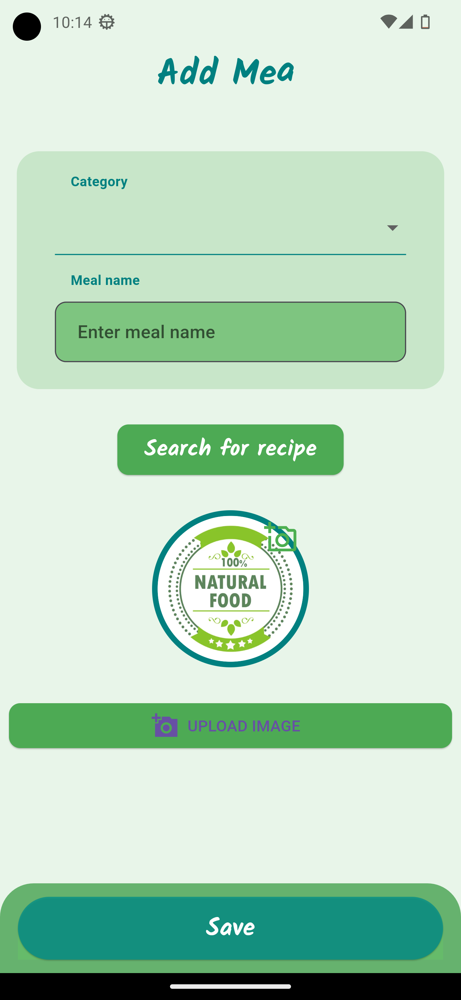
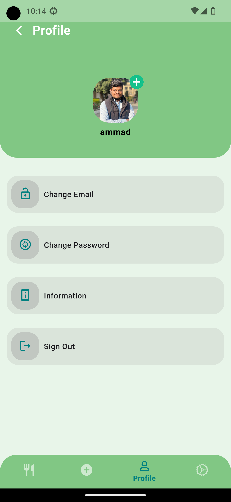
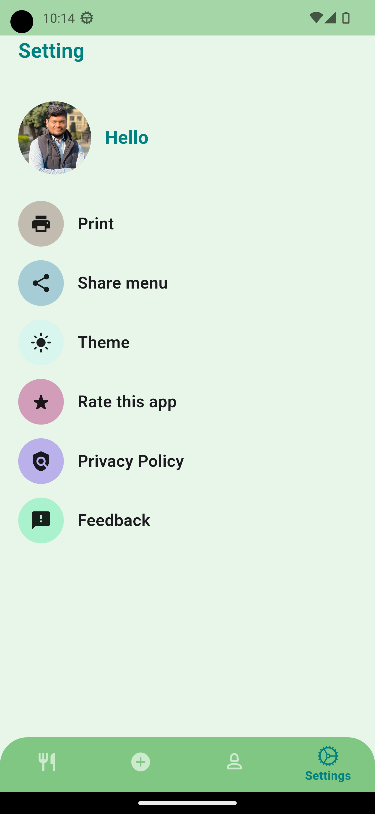

# Healthy Bites

Welcome to Healthy Bites, a mobile app designed to provide customized meal planning services, empowering users to make healthier eating choices right from their mobile devices. This README file provides an overview of the project, instructions for running the app locally, and other important information for developers and contributors.

## Overview

Healthy Bites is a Flutter-based mobile app developed to offer personalized meal planning services to users. The app aims to make healthy eating effortless and enjoyable by providing users with customized meal plans and access to a library of nutritious recipes.

## Features

- **Personalized Meal Plans:** Access customized meal plans tailored to individual dietary preferences and health goals.
- **Recipe Library:** Browse a rich collection of nutritious recipes curated by nutrition experts.
- **User Authentication:** Sign up and log in securely to access personalized meal plans and save favorite recipes.
- **Responsive Design:** Enjoy a seamless user experience across various devices and screen sizes.

## Installation

To run the app locally, follow these steps:

1. Clone the repository to your local machine:

   ```
   git clone https://github.com/Ammad-Naseer/healthy_bites.git
   ```

2. Navigate to the project directory:

   ```
   cd healthy_bites
   ```

3. Install dependencies using Flutter:

   ```
   flutter pub get
   ```

4. Run the app on a simulator or physical device:

   ```
   flutter run
   ```

## Contributing

Contributions to Healthy Bites are welcome! If you'd like to contribute to the project, please follow these steps:

1. Fork the repository.
2. Create a new branch for your feature or bug fix: `git checkout -b feature/my-feature`.
3. Make your changes and commit them: `git commit -m 'Add new feature'`.
4. Push to your forked repository: `git push origin feature/my-feature`.
5. Create a pull request for your changes.

## License

This project is licensed under the [MIT License](LICENSE).

## Contact

For questions or inquiries about Healthy Bites, please contact Ammad Naseer at <ammad.naseer33@gmail.com>.

## Screenshots

|  |  |  |
| :--------------------------------------: | :--------------------------------------: | :--------------------------------------: |
| *Boarding Screen 1* | *Boarding Screen 2* | *Boarding Screen 3* |

|  |  |
| :------------------------------------: | :---------------------------------------: |
| *Login Screen* | *Signup Screen* |

|  |  |
| :-----------------------------------: | :---------------------------------------------: |
| *Home Screen* | *Meal Plan Screen* |

|  |  |  |
| :----------------------------------------: | :-----------------------------------------: | :-----------------------------------------: |
| *Add Meal Screen* | *Profile Screen* | *Settings Screen* |
